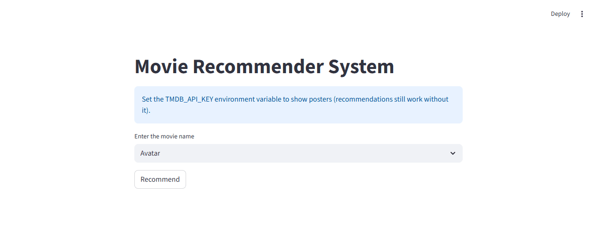

# Content-Based Movie Recommendation System 

## Project Overview
CineMatch is a content-based recommendation engine that suggests movies to users based on the similarity of their attributes. By analyzing metadata such as genres, keywords, cast, and crew, the system identifies patterns and recommends films that align with a user's specific interests.

## Key Features
* **Metadata Integration**: Merges comprehensive movie details with credits data to create a rich feature set.
* **Text Preprocessing**: Implements a pipeline to clean and transform complex JSON-like columns (genres, keywords, cast) into usable tags.
* **Natural Language Processing**: 
    * Utilizes `CountVectorizer` for text vectorization.
    * Removes stop words to focus on meaningful identifiers.
* **Similarity Engine**: Employs Cosine Similarity to calculate the distance between movie vectors and retrieve the most relevant matches.
* **Deployment Ready**: Includes functionality to export processed data using `pickle` for integration into web applications (e.g., Streamlit).

## Technical Stack
* **Languages**: Python
* **Libraries**: Pandas, NumPy, Scikit-learn (CountVectorizer, Cosine Similarity), NLTK (for stemming).
* **Data Sources**: TMDB 5000 Movies Dataset.

## How it Works
1. **Data Cleaning**: Irrelevant columns are dropped, and missing values are handled.
2. **Feature Extraction**: Top actors, directors, and genre keywords are extracted and combined into a single "tags" column.
3. **Vectorization**: Each movie is converted into a 5000-dimensional vector.
4. **Recommendation**: When a movie title is entered, the system finds the five movies with the highest cosine similarity scores.

## Dataset
This project uses the [TMDB 5000 Movies Dataset](https://www.kaggle.com/datasets/tmdb/tmdb-movie-metadata), which includes information on budget, genres, popularity, and credits for nearly 5,000 films. The raw CSVs ship zipped in `archive.zip`.

## Demo

The real Streamlit app (`app.py`), driven end to end — select a movie, click Recommend, get real results:



Terminal recording of the real evaluation run:


## Evaluation

`build_and_eval.py` reproduces the notebook's exact pipeline end-to-end (merge, genre/keyword/top-3-cast/director extraction, Porter stemming, `CountVectorizer(max_features=5000, stop_words='english')`, cosine similarity) against a hand-labeled ground truth of 10 movies with real, verified franchise/sequel relationships (not guessed — actual same-series films):

```
At-least-one-franchise-entry-in-top-5: 9/10 (90.0%)
```

The one miss is reported as-is: for "Iron Man 2," none of the top-5 recommendations (The Animal, Krrish, Flying By, The Truman Show, The Adventures of Elmo in Grouchland) are related — a genuine failure of pure tag-overlap similarity when a sequel's overview/keywords/cast tags don't happen to overlap enough with its predecessor's, not a cherry-picked easy case.

## Security fix

The Streamlit app (`app.py`) previously had a TMDB API key hardcoded directly in the source and committed to the repo. Fixed to read `TMDB_API_KEY` from an environment variable instead — the app still works without one, it just skips poster images.

## Running it

```bash
unzip archive.zip
python build_and_eval.py     # rebuilds movies_dict.pkl and similarity.pkl (not committed -- 184MB, regenerate locally)
export TMDB_API_KEY=your_key_here   # optional, only needed for poster images
streamlit run app.py
```
